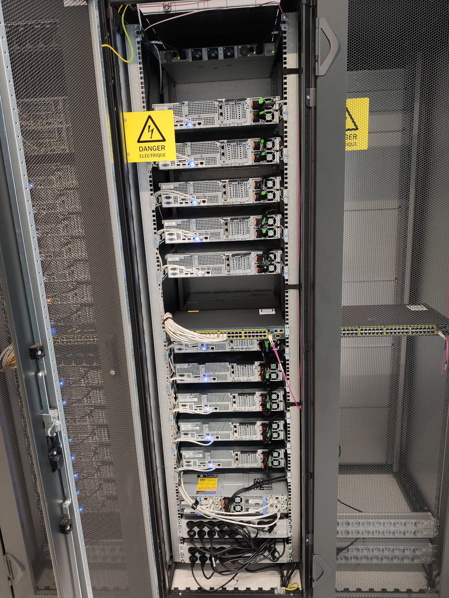

# System, Network & Virtualisation



## Introduction

<!---
footer: Introduction
_footer: ""
--->

### # whoami

<!--
Yousign depuis 2 ans. Polytech depuis 5 ans.
-->

```
Name          : Jean Wasilewski
Current work  : Yousign / PolytechLille
Previous work : CNAMTS / Worldline / OVH / Scaleway
Hobby         : House renovation / Climbing / Electronics & Computer Science
Formation     : PolytechLille / IMA 2016
```

### Plan

<!--
3 modules denses: virtualisation, administration des systems et reseaux et leur application
Perimetre large: du demarrage d'un ordinateur au deploiement de services web
-->

- Simplified approach of modern operating systems
- Virtualisation & containerisation
- Infrastructure architecture
- Networking & protocols

## Simplified approach of modern operating systems

<!--
footer: Simplified approach of modern operating systems
_footer: ""
-->

### Booting: from power button to shell

<!--
Details des composants d'un ordinateur
Explication des difference entre BIOS et UEFI
-->

- Interruption on BIOS / UEFI
- BIOS / UEFI waking up, initializaing peripherals
- BIOS / UEFI starts bootloader
- Bootloader starts a kernel
- Kernel start `init`
- `init` starts all required services

### What is a kernel?

### What is `init`?

### How are services managed?

### Login / Window manager

### How operating systems are created?

<!--
Debian based, BSD based, debootstrap, chroot
LFS
Bonus: /etc/passwd
-->

## Virtualisation

<!--
footer: Virtualisation
_footer: ""
-->

### What is virtualisation?

### Virtualisation

### Paravirtualisation

### Containerisation

### Processes

### Namespaces

## Infrastructure architecture

<!--
footer: Infrastructure architecture
_footer: ""
-->

<!--
How Spotify works?
-->

### Docker

### Web servers

### Proxy

### Reverse proxy / Load balancers

### Stateless / Statefull

### Network storages

### Databases

### Cache

### Authentication

### Firewall

### High availability

## Networking

<!--
footer: Networking
_footer: ""
-->

### OSI layers

### IP

<!--
Netmasks
-->

### Routes

### VLAN

<!--
802.1q
-->

### Bridge

### High availability

<!--
LACP / ECMP
-->

### Firewall

<!--
NAT / iptables / nftables / ufw
-->

### DHCP

### DNS

### SSH

### HTTP

<!--
Proto, REST
-->

### GRPC

<!--
Protobuf
-->

## Technological focus

<!--
footer: Technological focus
_footer: ""
-->

### Nginx

### Docker

### HAProxy

### Proxmox

### Nomad

### Consul

### Gitlab + Gitlab CI

### Ceph / RBD / S3

### Kernel building

### iPXE

## Tutorials

<!--
footer: Tutorials
_footer: ""
-->


### Create an operating system

#### Same part as IS4

Target: discover technologies and use a web server

1. On proxmox: manual conf vm network / ping google / reboot proof
2. Install nginx / conf dns / setup static page
3. Install HAProxy / redirect 8888 to nginx
4. Install docker / pull nginx image / copy static page in container / redirect haproxy 8889 to container

---

Target: discover technologies and use a web server

5. Docker image creation with static page / publish on registry
6. Install nomad single instance
7. Create nomad job definition to run previous container with Nomad
8. Increase job definition count to run 3 container / configure HAProxy with auto discovery
9. Add route on Zabeth to view the page

---

Target: setup a distributed service + deploy from CI

10. Reconfigure nomad to use the common consul and common nomad server
11. Create git repo on Gitlab / Store dockerfile + static page
12. Update job definition in repo / setup CI / deploy new configuration to global nomad
13. Update global haproxy configuration to redirect to the the newly deployed web service

---

#### New parts for SE4

Target: build and deploy more complex services

14. Create new repo as the web repo to build and push a dockerized DHCP server
15. Create a new repo as the web repo to build and push a dockerized TFTP server with ipxe
16. Create a new repo to build and push on S3 a debootstrap image of latest debian version

---

Target: boot an OS from the network

17. Update web server to host an ipxe configuration file boot this new OS
18. Mount `/home/xxx` as rbd volume from Ceph

Now the new OS boots and use remote storage for users.

---

#### Extra parts for experimented SE4

Target: build a custom OS

19. Build a kernel (Bonus: less than 50 Mo + boot time < 2s)
20. Build an init that displays your team ID on the terminal (Bonus: pimped init banner)
21. Build an init that starts network interfaces

---

Target: create a logging service

22. Create a script / service that request user credentials, checks its validity against /etc/passwd, then mount dynamically user's home from rbd
22. Improve script and update initrd to have a window manager starting after logging
