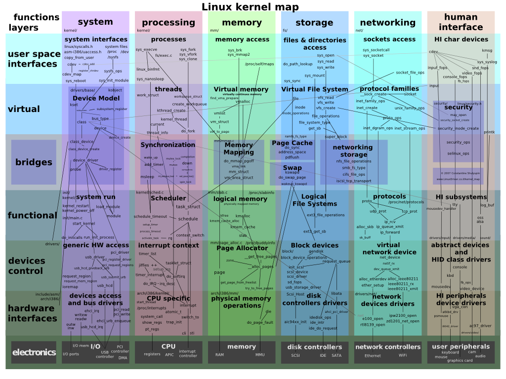
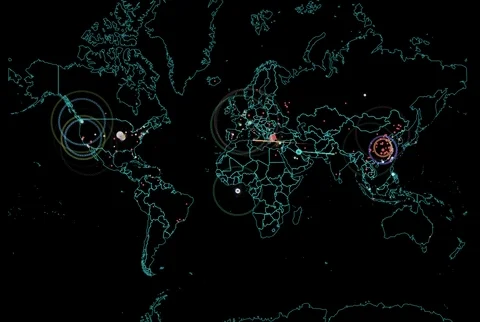

<style>
img[alt~="center"] {
  display: block;
  margin: 0 auto;
}
</style>

# System, Network & Virtualisation


## Introduction

<!---
footer: Introduction
_footer: ""
--->

### # whoami

<!--
Yousign depuis 2 ans. Polytech depuis 5 ans.
-->

```
Name          : Jean Wasilewski
Current work  : Yousign / PolytechLille
Previous work : CNAMTS / Worldline / OVH / Scaleway
Hobby         : DIY / Mechanic / Climbing / Electronics & Computer Science
Formation     : PolytechLille / IMA 2016
```

### Disclamer


### Plan

<!--
3 modules denses: virtualisation, administration des systems et reseaux et leur application
Perimetre large: du demarrage d'un ordinateur au deploiement de services web
Bonus: question random toutes les heures
-->

- Simplified approach of modern operating systems
- Virtualisation & containerisation
- Infrastructure architecture
- Networking & protocols
- Focus on specific technologies
- Tutorial introduction

## Simplified approach of modern operating systems

<!--
footer: Simplified approach of modern operating systems
_footer: ""
-->

### Booting: from power button to shell

<!--
Details des composants d'un ordinateur
Explication des difference entre BIOS et UEFI
-->

- Interruption on BIOS / UEFI
- BIOS / UEFI waking up, initializaing peripherals
- BIOS / UEFI starts bootloader
- Bootloader starts a kernel
- Kernel start `init`
- `init` starts all required services

### What is a kernel?

<!--
Driver / Device initialization
-->

- Layer between physical components and userland
- Expose high level API
- Schedule processes
- Manage memory
- And much more!

---



### What is `init`?

<!--
Rappel sur execve
-->

- First program started by the kernel
- Kernel switch to userland (`init`, `systemd-init`, `wininit.exe`)
- Process ID `1`
- Usually `execve` to a service manager

### How are services managed?

<!--
Explication de la reconciliation
-->

- Init starts a service manager (`systemd`, `openrc`, `svchost.exe`)
- Can ensure reconciliation
- Starts end user services (`nginx`, `sshd`, `kde4`)

### Login / Window manager

<!--
Bonus: /etc/passwd
-->

- Login manager: usually started by X11 or Wayland
- Login manager: validates identity and starts window manager
- Window manager: provides a graphical environment for users

Notable WM: i3, Gnome, KDE

### How operating systems are created?

<!--
Debian based, BSD based, LFS
TODO: debootstrap, chroot
-->

- Kernel, modular or monolithic
- Initrd, containing temporary root system
- Init and service manager
- Package manager (`apt`, `yum`, `dnf`, `pacman`, `nuget`, `brew`)
- Example of OS creation later in this presentation

## Virtualisation

<!--
footer: Virtualisation
_footer: ""
-->

### What is virtualisation?

Virtualization is a process allowing the share of hardware resources while ensuring an environment seperation.

Three kind of virtualization:

- Virtualization
- Paravirtualization
- Containerization

### Virtualisation

- Virtualization consist of a lonely process
- This process emulates a whole computer
- The virtual machine is totally isolated from the host

This whole computer emulation is named Virtual Machine.
Or simply VM.

### Paravirtualisation

- Paravirtualization also consist of a lonely process
- This process also emulates a whole computer
- The virtual machine is a little bit less isolated from the host (share CPU)

### Containerisation

- Containerization also consist of a lonely process
- This process just runs one software
- The software is isolated from the host with namespaces

### What is a container?

- A container is an archive
- It contains the minimal requirement to run one software
- The process is isolated (only see itself) with the help of the host kernel

### Processes

- Except init, all created by init or its child
- Are referenced by their ID
- In Linux, easily explorable through procfs

### Processes (example)

```bash
henyxia@yggdrasil:~ pstree
systemd─┬─ModemManager───2*[{ModemManager}]
        ├─NetworkManager───2*[{NetworkManager}]
        ├─alsactl
        ├─auditd───{auditd}
        ├─avahi-daemon───avahi-daemon
        ├─bash───firefox─┬─RDD Process───3*[{RDD Process}]
        │                ├─4*[Web Content───42*[{Web Content}]]
        │                ├─Web Content───39*[{Web Content}]
        │                └─80*[{firefox}]
        ├─bash───pavucontrol───3*[{pavucontrol}]
        ├─bash───spotify─┬─spotify───spotify───11*[{spotify}]
        │                ├─2*[spotify───4*[{spotify}]]
        │                └─29*[{spotify}]
```

### Processes (demo)

<!--
Transition:
on a vu les process
on sait que le noyau facilite la separation pour les container
maintenant regardant comment
-->

_procfs exploration_

### Namespaces

<!--
explication des differents ns
transition:
avant de passer a la section suivante
on peut se poser la question: pourquoi utiliser les container?
-->

- Namespaces are an isolation method given by the kernel
- Way lighter than a full virtualization
- Different kind of namespaces exists
    - mnt, pid, net, ipc, uts, user, ...

### Containers, why?

<!--
Explain isolation difference
Explain "it works on my computer"
-->

- Lighter and faster than (para)virtualisation
- Easily shareable (cf hub.docker.com)
- Repeatable builds

### Pet vs cattle principle

- Servers are now generic, not unique anymore
- Services are deployed identically everywhre
- Making maintenance (and life) easier

## Infrastructure architecture

<!--
footer: Infrastructure architecture
_footer: ""
-->

<!--
How Spotify works?
Several infrastructure architectural blocks
That will be detailed now
-->

### Docker

<!--
Emphasize on how docker changed the industry
-->

- Docker is containerization technology
- It relies on two technologies:
    - `libcontainerd` to manage container images
    - `runc` to operate kernel namespaces

### Web servers

<!--
TODO: improve this slide
Maybe add my contribution at OVH
-->

- Software that transmit web pages using the HTTP protocols

Most known: Apache 2, Nginx, Caddy

### Proxy

<!--
TODO: improve this slide
transition: maintenant la meme dans l'autre sens
-->

- Handle the HTTP query and return the result
- Allow avoiding giving direct access to HTTP

Most known: Apache 2, Squid

### Reverse proxy / Load balancers

<!--
dessin d'explication des LB/reverse
detail du fonctionnement de HAProxy plus loin TODO
-->

- Accept incoming traffic
- Transfer the request to another service
- Distribute the load on these other services

Most known: Apache 2, Nginx, HAProxy

### Stateless / Stateful

<!--
donner des examples avec des logs et des bdd
-->

- Important distinction between container types
- If persistence is needed: statefull
- Stateless otherwise

### Network storages

<!--
as explained with pet vs cattle
explain why we don't want local storage
query mtbf of dd (2 to 5 years)
explain different storage kinds
Ceph will be detailed later
-->

- Allow writing remotely data
- Allow data replication
- Allow consistency assurance
- Several kind: block, object and file

Most known: Ceph, glusterfs, seaweedfs

### Databases

<!--
emphasize on stateful
explain difference between rel and non-rel
give my reco on those db
-->

- Two types: relational and non-relational
- Mostly queried through the SQL language

Most known: MySQL, PostgreSQL, sqlite3, MongoDB, CassandraDB

### Cache

<!--
varnish explain assets caching
explain ORM
-->

- Many different types:
    - Objects
    - Key
    - Session
    - SQL preprocessing
    - SQL results

Most known: Varnish, Redis, Memcached

### Authentication

<!--
can be cascaded
-->

- Register user with its hierarchy
- Allow grouping users
- Validate identity

Most known protocols: OAuth, SAML, LDAP
Most known software: OAuth2proxy, Authelia, OpenLDAP

### Firewall

<!--
TODO: improve this slide
-->

- Restrict access between networks

Most known: OPNsense, pfSense

### High availability

<!--
TODO: improve this slide
-->

- Avoid Single Point Of Failures
- Ensure Service Liability Agreements

## Networking

<!--
footer: Networking
_footer: ""
-->

### OSI layers

<!--
Open Systems Interconnection models or layers
-->

- Conceptual model from ISO
- Communcation between systems are split into 7 layers
- Lower levels are closer to hardware / higher to end-user

### OSI layers

<!--
1. 1000base-t / rs-232
2. ethernet / arp
3. ip / ipsec / icmp
4. tcp / udp / quic
5. sockets (session establishment of connected proto) / rpc
6. ssl
7. https / ftp / smtp
-->


### IP

<!--
- small ipv4 history
- nat introduction
- private networks
- communication types (unicast, multicast, broadcast)
- explanation ip addresses and netmask calculation
- do not omit ranges limitation (broadcast, reserved network)
-->

- Stands for Internel Protocol
- Two versions: v4 & v6
- Composed of addresses, netmask, networks and routes

### Routes

<!--
- explanation of private and public networks
- Local Area Network / Wide Area Network
- Next: how to isolate lan? (firewall later, vlan now)
-->

- Are network with a gateway
- Network can be public or private (see below)
    - `192.168.0.0/16`
    - `172.16.0.0/12`
    - `10.0.0.0/8`
- Examples:
    - `10.12.14.0/24 via 172.17.0.22`
    - `0.0.0.0/0 via 192.168.1.254`

### 802.1q

<!--
- 802.3 -> Ethernet
- Native, tagged
- Swtich and routers
-->

- Network standard, also referred as Dot1q
- Supports Virtual Local Area Networking
- Represented by an ID between 1 to 4094


### Bridge

- Logical switch
- Allow connecting multiple interfaces
- Can have IP address, allowed and native VLAN

### High availability

<!--
- Pods through LB
- LACP 802.3as + 802.1AX / ECMP
-->

- Everything that is not redundant is a SPOF
- Almost every OSI layer can be redundant
- Network example: failover (LACP) vs load balancing (ECMP)

### Firewall

<!--
les experts miami
-->


### Firewall

<!--
norse attack map
https://threatmap.checkpoint.com/
https://www.digitalattackmap.com/
-->



### Firewall

<!--
Before going to the "real form` FW, let's see this overview
No suck thing as "breaching" a firewall
NAT / iptables / nftables / ufw
DNAT / SNAT / Masquarade
-->

- Controlled by softwares like `iptables`, `nftables`, `ufw`
- Composed of tables, chains and rules
- Main tables: `filter` and `nat`
- Main chains: `INPUT`, `FORWARD`, `OUTPUT`

### Firewall


### DHCP

<!--
- Proto: UDP
- First 3 in broadcast
- Last one in unicast
-->

- Layer 7 protocol
- Used to assign dinamycally IPs
- Composed of 4 messages
    - `DISCOVER`
    - `OFFER`
    - `REQUEST`
    - `ACKNOLEDGE`

### DNS

<!--
- Domain Name Server
-->

- Layer 7 protocol
- Use to associate IP with FQDN (and vice versa)
- Allow storing text with FQDN


### DNS record types

- A: Host address
- AAAA: IPv6 host address
- ALIAS: Auto resolved alias
- CNAME: Canonical name for an alias
- MX: Mail eXchange
- NS: Name Server
- TXT: text field

### DNS common command

```
$ dig www.google.fr
; <<>> DiG 9.11.13-RedHat-9.11.13-3.fc31 <<>> www.google.fr
;; global options: +cmd
;; Got answer:
;; ->>HEADER<<- opcode: QUERY, status: NOERROR, id: 47305
;; flags: qr rd ra; QUERY: 1, ANSWER: 1, AUTHORITY: 0, ADDITIONAL: 1
...snip...
;; ANSWER SECTION:
www.google.fr.      23  IN  A   216.58.198.195

;; Query time: 8 msec
;; SERVER: 192.168.255.10#53(192.168.255.10)
;; WHEN: Mon Sep 21 22:19:29 CEST 2020
;; MSG SIZE  rcvd: 58
```

### DNS common command (short)

```
henyxia@yggdrasil:~ dig +short www.google.fr
216.58.198.195
```

### SSH

- Layer 7 protocol
- Allow connection to a remote server securely
- Uses key or password

### HTTP

<!--
Now ammended with more than 10 RFC
Common status code / http://http.cat
Request methods: OPTIONS GET HEAD POST PUT DELETE TRACE CONNECT PATCH
Common headers: Cookie ETag Location HTTP referer DNT X-Forwarded-For
Web API introduction
Proto, REST
-->

- Layer 7 protocol, defined by RFC1945 of the IETF
- Used to communicate around Web pages
- Widely used, also as base for other higher level protocols

### gRPC

<!--
Google Remote Procedure Calls
Can be compatible with REST API
Compressed by design, binary
-->

- Layer 7 protocol, initially developped by Google
- Define messages through a dedicated language: Protocol Buffers
- Ensure message structure, data format and type

## Technological focus

<!--
footer: Technological focus
_footer: ""
-->

### Nginx

### Docker

### HAProxy

### Proxmox

### Nomad

### Consul

### Gitlab + Gitlab CI

### Ceph / RBD / S3

### Kernel building

### iPXE

## Tutorials

<!--
footer: Tutorials
_footer: ""
-->


### Create an operating system

#### Same part as IS4

Target: discover technologies and use a web server

1. On proxmox: manual conf vm network / ping google / reboot proof
2. Install nginx / conf dns / setup static page
3. Install HAProxy / redirect 8888 to nginx
4. Install docker / pull nginx image / copy static page in container / redirect haproxy 8889 to container

---

Target: discover technologies and use a web server

5. Docker image creation with static page / publish on registry
6. Install nomad single instance
7. Create nomad job definition to run previous container with Nomad
8. Increase job definition count to run 3 container / configure HAProxy with auto discovery
9. Add route on Zabeth to view the page

---

Target: setup a distributed service + deploy from CI

10. Reconfigure nomad to use the common consul and common nomad server
11. Create git repo on Gitlab / Store dockerfile + static page
12. Update job definition in repo / setup CI / deploy new configuration to global nomad
13. Update global haproxy configuration to redirect to the the newly deployed web service

---

#### New parts for SE4

Target: build and deploy more complex services

14. Create new repo as the web repo to build and push a dockerized DHCP server
15. Create a new repo as the web repo to build and push a dockerized TFTP server with ipxe
16. Create a new repo to build and push on S3 a debootstrap image of latest debian version

---

Target: boot an OS from the network

17. Update web server to host an ipxe configuration file boot this new OS
18. Mount `/home/xxx` as rbd volume from Ceph

Now the new OS boots and use remote storage for users.

---

#### Extra parts for experimented SE4

Target: build a custom OS

19. Build a kernel (Bonus: less than 50 Mo + boot time < 2s)
20. Build an init that displays your team ID on the terminal (Bonus: pimped init banner)
21. Build an init that starts network interfaces

---

Target: create a logging service

22. Create a script / service that request user credentials, checks its validity against /etc/passwd, then mount dynamically user's home from rbd
22. Improve script and update initrd to have a window manager starting after logging

## Thank you for your attention

<!--
footer: ""
-->

##### If you have any question, feel free to ask!
