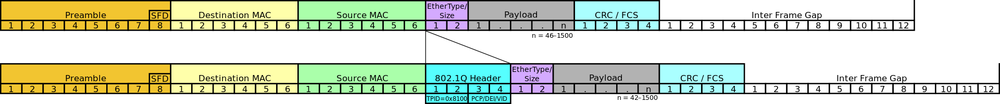

<style>
img[alt~="center"] {
  display: block;
  margin: 0 auto;
}
</style>

# System, Network & Virtualisation


## Introduction

<!---
footer: Introduction
_footer: ""
--->

### # whoami

<!--
Yousign depuis 2 ans. Polytech depuis 5 ans.
-->

```
Name          : Jean Wasilewski
Current work  : Yousign / PolytechLille
Previous work : CNAMTS / Worldline / OVH / Scaleway
Hobby         : DIY / Mechanic / Climbing / Electronics & Computer Science
Formation     : PolytechLille / IMA 2016
```

### Disclaimer


### Plan

<!--
3 modules denses: virtualisation, administration des systems et reseaux et leur application
Perimetre large: du demarrage d'un ordinateur au deploiement de services web
Bonus: question random toutes les heures
-->

- Simplified approach of modern operating systems
- Virtualisation & containerisation
- Infrastructure architecture
- Networking & protocols
- Focus on specific technologies
- Tutorial introduction

## Simplified approach of modern operating systems

<!--
footer: Simplified approach of modern operating systems
_footer: ""
-->

### Booting: from power button to shell

<!--
Details des composants d'un ordinateur
Explication des difference entre BIOS et UEFI
-->

- Interruption on BIOS / UEFI
- BIOS / UEFI waking up, initializaing peripherals
- BIOS / UEFI starts bootloader
- Bootloader starts a kernel
- Kernel start `init`
- `init` starts all required services

### What is a kernel?

<!--
Driver / Device initialization
-->

- Layer between physical components and userland
- Expose high level API
- Schedule processes
- Manage memory
- And much more!

---


### What is `init`?

<!--
Rappel sur execve
-->

- First program started by the kernel
- Kernel switch to userland (`init`, `systemd-init`, `wininit.exe`)
- Process ID `1`
- Usually `execve` to a service manager

### How are services managed?

<!--
Explication de la reconciliation
-->

- Init starts a service manager (`systemd`, `openrc`, `svchost.exe`)
- Can ensure reconciliation
- Starts end user services (`nginx`, `sshd`, `kde4`)

### Login / Window manager

<!--
Bonus: /etc/passwd
-->

- Login manager: usually started by X11 or Wayland
- Login manager: validates identity and starts window manager
- Window manager: provides a graphical environment for users

Notable WM: i3, Gnome, KDE

### How operating systems are created?

<!--
Debian based, BSD based, LFS
TODO/technical-focus: debootstrap, chroot
-->

- Kernel, modular or monolithic
- Initrd, containing temporary root system
- Init and service manager
- Package manager (`apt`, `yum`, `dnf`, `pacman`, `nuget`, `brew`)
- Example of OS creation later in this presentation

## Virtualisation

<!--
footer: Virtualisation
_footer: ""
-->

### What is virtualisation?

Virtualization is a process allowing the share of hardware resources while ensuring an environment seperation.

Three kind of virtualization:

- Virtualization
- Paravirtualization
- Containerization

### Virtualisation

- Virtualization consist of a lonely process
- This process emulates a whole computer
- The virtual machine is totally isolated from the host

This whole computer emulation is named Virtual Machine.
Or simply VM.

### Paravirtualisation

- Paravirtualization also consist of a lonely process
- This process also emulates a whole computer
- The virtual machine is a little bit less isolated from the host (share CPU)

### Containerisation

- Containerization also consist of a lonely process
- This process just runs one software
- The software is isolated from the host with namespaces

### What is a container?

- A container is an archive
- It contains the minimal requirement to run one software
- The process is isolated (only see itself) with the help of the host kernel

### Processes

- Except init, all created by init or its child
- Are referenced by their ID
- In Linux, easily explorable through procfs

### Processes (example)

```bash
henyxia@yggdrasil:~ pstree
systemd─┬─ModemManager───2*[{ModemManager}]
        ├─NetworkManager───2*[{NetworkManager}]
        ├─alsactl
        ├─auditd───{auditd}
        ├─avahi-daemon───avahi-daemon
        ├─bash───firefox─┬─RDD Process───3*[{RDD Process}]
        │                ├─4*[Web Content───42*[{Web Content}]]
        │                ├─Web Content───39*[{Web Content}]
        │                └─80*[{firefox}]
        ├─bash───pavucontrol───3*[{pavucontrol}]
        ├─bash───spotify─┬─spotify───spotify───11*[{spotify}]
        │                ├─2*[spotify───4*[{spotify}]]
        │                └─29*[{spotify}]
```

### Processes (demo)

<!--
Transition:
on a vu les process
on sait que le noyau facilite la separation pour les container
maintenant regardant comment
-->

_procfs exploration_

### Namespaces

<!--
explication des differents ns
transition:
avant de passer a la section suivante
on peut se poser la question: pourquoi utiliser les container?
-->

- Namespaces are an isolation method given by the kernel
- Way lighter than a full virtualization
- Different kind of namespaces exists
    - mnt, pid, net, ipc, uts, user, ...

### Containers, why?

<!--
Explain isolation difference
Explain "it works on my computer"
-->

- Lighter and faster than (para)virtualisation
- Easily shareable (cf hub.docker.com)
- Repeatable builds

### Pet vs cattle principle

- Servers are now generic, not unique anymore
- Services are deployed identically everywhre
- Making maintenance (and life) easier

## Infrastructure architecture

<!--
footer: Infrastructure architecture
_footer: ""
-->

<!--
How Spotify works?
Several infrastructure architectural blocks
That will be detailed now
-->

### Docker

<!--
- Emphasize on how docker changed the industry
- Explain Docker images / networks / volume
-->

- Docker is containerization technology
- It relies on two technologies:
    - `libcontainerd` to manage container images
    - `runc` to operate kernel namespaces

### Web servers

<!--
Maybe add my contribution at OVH
-->

- Software that transmit web pages using the HTTP protocols
- Understand HTTP request and respond with file content (HTML, CSS, JS, ...)
- Relay to more complex language interpreter, like PHP

Most known: Apache 2, Nginx, Caddy

### Proxy

<!--
- security of proxies inside perimeters
- legal aspect of proxies in universities

Next slide: how about proxies, but in another way?
-->

- Handle the HTTP query and return the result
- Allow avoiding giving direct access to HTTP
- Typical use cases: restrained perimeter or universities

Most known: Apache 2, Squid

### Reverse proxy / Load balancers

<!--
- Draw how LB / reverse proxy works
- Explain differences between LB and RP
TODO/technical-focus: how HAProxy works
-->

- Accept incoming traffic
- Transfer the request to another service
- Distribute the load on these other services

Most known: Apache 2, Nginx, HAProxy

### Stateless / Stateful

<!--
donner des examples avec des logs et des bdd
-->

- Important distinction between container types
- If persistence is needed: statefull
- Stateless otherwise

### Network storages

<!--
as explained with pet vs cattle
explain why we don't want local storage
query mtbf of dd (2 to 5 years)
explain different storage kinds
Ceph will be detailed later
-->

- Allow writing remotely data
- Allow data replication
- Allow consistency assurance
- Several kind: block, object and file

Most known: Ceph, glusterfs, seaweedfs

### Databases

<!--
emphasize on stateful
explain difference between rel and non-rel
give my reco on those db
-->

- Two types: relational and non-relational
- Mostly queried through the SQL language

Most known: MySQL, PostgreSQL, sqlite3, MongoDB, CassandraDB

### Cache

<!--
varnish explain assets caching
explain ORM
-->

- Many different types:
    - Objects
    - Key
    - Session
    - SQL preprocessing
    - SQL results

Most known: Varnish, Redis, Memcached

### Authentication

<!--
can be cascaded
-->

- Register user with its hierarchy
- Allow grouping users
- Validate identity

Most known protocols: OAuth, SAML, LDAP
Most known software: OAuth2proxy, Authelia, OpenLDAP

### Firewall

- Restrict access between networks
- Can be software or hardware
- More on that topic later!

Most known: OPNsense, pfSense

### High availability

<!--
- Draw eyeballs access to a website, all SPOF
- Google SRE's approach of SLA
- Talk about LB sawn earlier
-->

- Avoid Single Point Of Failures
- Ensure Service Liability Agreements
- More on that topic also later!

## Networking

<!--
footer: Networking
_footer: ""
-->

### OSI layers

<!--
Open Systems Interconnection models or layers
-->

- Conceptual model from ISO
- Communcation between systems are split into 7 layers
- Lower levels are closer to hardware / higher to end-user

### OSI layers

<!--
1. 1000base-t / rs-232
2. ethernet / arp
3. ip / ipsec / icmp
4. tcp / udp / quic
5. sockets (session establishment of connected proto) / rpc
6. ssl
7. https / ftp / smtp
-->


### IP

<!--
- small ipv4 history
- nat introduction
- private networks
- communication types (unicast, multicast, broadcast)
- explanation ip addresses and netmask calculation
- do not omit ranges limitation (broadcast, reserved network)
-->

- Stands for Internel Protocol
- Two versions: v4 & v6
- Composed of addresses, netmask, networks and routes

### Routes

<!--
- explanation of private and public networks
- Local Area Network / Wide Area Network
- Next: how to isolate lan? (firewall later, vlan now)
-->

- Are network with a gateway
- Network can be public or private (see below)
    - `192.168.0.0/16`
    - `172.16.0.0/12`
    - `10.0.0.0/8`
- Examples:
    - `10.12.14.0/24 via 172.17.0.22`
    - `0.0.0.0/0 via 192.168.1.254`

### Particular networks

<!--
- loopback
- cgnat
- apipa
- multicast
- broadcast
-->

- `127.0.0.0/8`
- `100.64.0.0/10`
- `169.254.0.0/16`
- `224.0.0.0/4`
- `255.255.255.255/32`

### 802.1q

<!--
- 802.3 -> Ethernet
- Native, tagged
- Swtich and routers
-->

- Network standard, also referred as Dot1q
- Supports Virtual Local Area Networking
- Represented by an ID between 1 to 4094



### Bridge

<!--
live example with several host / bridges
-->

- Logical switch
- Allow connecting multiple interfaces
- Can have IP address, allowed and native VLAN

### High availability

<!--
- Pods through LB
- LACP 802.3as + 802.1AX / ECMP
-->

- Everything that is not redundant is a SPOF
- Almost every OSI layer can be redundant
- Network example: failover (LACP) vs load balancing (ECMP)

### Firewall

<!--
les experts miami
-->


### Firewall

<!--
norse attack map
https://threatmap.checkpoint.com/
https://www.digitalattackmap.com/
-->


### Firewall

<!--
Before going to the "real form` FW, let's see this overview
No suck thing as "breaching" a firewall
NAT / iptables / nftables / ufw
DNAT / SNAT / Masquarade
-->

- Controlled by softwares like `iptables`, `nftables`, `ufw`
- Composed of tables, chains and rules
- Main tables: `filter` and `nat`
- Main chains: `INPUT`, `FORWARD`, `OUTPUT`

### Firewall


### DHCP

<!--
- Proto: UDP
- First 3 in broadcast
- Last one in unicast
-->

- Layer 7 protocol
- Used to assign dinamycally IPs
- Composed of 4 messages
    - `DISCOVER`
    - `OFFER`
    - `REQUEST`
    - `ACKNOLEDGE`

### DNS

<!--
- Domain Name Server
-->

- Layer 7 protocol
- Use to associate IP with FQDN (and vice versa)
- Allow storing text with FQDN


### DNS record types

- A: Host address
- AAAA: IPv6 host address
- CNAME: Canonical name for an alias
- MX: Mail eXchange
- NS: Name Server
- TXT: text field

### DNS common command

```
$ dig www.google.fr
; <<>> DiG 9.11.13-RedHat-9.11.13-3.fc31 <<>> www.google.fr
;; global options: +cmd
;; Got answer:
;; ->>HEADER<<- opcode: QUERY, status: NOERROR, id: 47305
;; flags: qr rd ra; QUERY: 1, ANSWER: 1, AUTHORITY: 0, ADDITIONAL: 1
...snip...
;; ANSWER SECTION:
www.google.fr.      23  IN  A   216.58.198.195

;; Query time: 8 msec
;; SERVER: 192.168.255.10#53(192.168.255.10)
;; WHEN: Mon Sep 21 22:19:29 CEST 2020
;; MSG SIZE  rcvd: 58
```

### DNS common command (short)

```
henyxia@yggdrasil:~ dig +short www.google.fr
216.58.198.195
```

### SSH

<!--
- key exchange technics
- -l / -p / -J / -L / -R
-->

- Layer 7 protocol
- Allow connection to a remote server securely
- Uses key or password

### HTTP

<!--
Now ammended with more than 10 RFC
Common status code / http://http.cat
Request methods: OPTIONS GET HEAD POST PUT DELETE TRACE CONNECT PATCH
Common headers: Cookie ETag Location HTTP referer DNT X-Forwarded-For
Web API introduction
Proto, REST
HTTPS
-->

- Layer 7 protocol, defined by RFC1945 of the IETF
- Used to communicate around Web pages
- Widely used, also as base for other higher level protocols

### gRPC

<!--
Google Remote Procedure Calls
Can be compatible with REST API
Compressed by design, binary
-->

- Layer 7 protocol, initially developped by Google
- Define messages through a dedicated language: Protocol Buffers
- Ensure message structure, data format and type

## Technological focus

<!--
footer: Technological focus
_footer: ""
-->

### Nginx

- Web server / reverse proxy / load balancer written in C
- Available on most Unix distributions
- Allow to balance traffic and avoid downtime in case of failure

<!--
footer: Technological focus: Nginx
-->

---

Main configuration

```
$ cat /etc/nginx/nginx.conf
user www-data;
pid /run/nginx.pid;
include /etc/nginx/modules-enabled/*.conf;
http {
    include /etc/nginx/mime.types;
    ssl_protocols TLSv1 TLSv1.1 TLSv1.2;
    ssl_prefer_server_ciphers on;
    access_log /var/log/nginx/access.log;
    error_log /var/log/nginx/error.log;
    include /etc/nginx/conf.d/*.conf;
    include /etc/nginx/sites-enabled/*;
}

```

---

```
$ cat /etc/nginx/sites-enabled/default

server {
    listen 8092 default_server;

    root /var/www/mywebsite;

    index index.html;

    server_name _;

    location / {
        # First attempt to serve request as file, then
        # as directory, then fall back to displaying a 404.
        try_files $uri $uri/ =404;
    }
}
```

---

<!--
footer: Technological focus: Docker
-->

#### Pull an image

<!--
explain image, registry, tag
-->

```
$ docker pull nginx:latest
latest: Pulling from library/nginx
b8f262c62ec6: Pull complete
a6639d774c21: Pull complete
22a7aa8442bf: Pull complete
Digest: sha256:9688d0dae8812dd2437947b756393eb0779487e361aa2ffbc3a529dca61f102c
Status: Downloaded newer image for nginx:latest
```

---

#### List local images

```
$ docker image ls
REPOSITORY                 TAG                      IMAGE ID            CREATED             SIZE
debian                     stable-slim              da838f7eb4f8        11 days ago         69.2MB
batman-dhcp                latest                   deb682e07fda        2 weeks ago         73.3MB
rabbitmq                   3-management             d55229deb03e        8 weeks ago         187MB
postgres                   11                       b7af9a7c9a68        3 months ago        282MB
alpine                     latest                   a24bb4013296        3 months ago        5.57MB
rabbitmq                   3.7-management           c497955c219a        4 months ago        180MB
redis                      alpine                   29c713657d31        4 months ago        31.6MB
golang                     1.13.11-buster           6a67120df3f4        4 months ago        803MB
nginx                      alpine                   89ec9da68213        5 months ago        19.9MB
djfarrelly/maildev         latest                   8c016b0ceb3c        14 months ago       79.8MB
mysql                      5.6.43                   bc788a6a2745        18 months ago       256MB
postgres                   10.2-alpine              400ef39e0dbf        2 years ago         39.5MB
```

---

#### Delete local image

```
$ docker image rm 926fbd714c0e # also docker rmi debian:stable-slim
Deleted: sha256:926fbd714c0e0ade9f56cfde5854b507e29dea584d747267a9d1fd92e4a21995
Deleted: sha256:c086d58b3b8a851bb63694c637725d89b4bec9bf42bc22afbcea80e04d6248f6
Deleted: sha256:de230fa08e61512837c758f79de4451b59aa7b35b059536ce8f092a798170341
Deleted: sha256:cce1de5fafa9b555b784b8aceb95f04a84bb24170aa59a017cfd0acd62248e64
Deleted: sha256:7bcfcbd4f645beaa4dc663a1c1d683e1eaf084c5a3a04ceeddd1ccd4a7ece044
Deleted: sha256:874b3e23fbaf3e9c3c08b0c8b3130633f9fc1b91bf49a41540f28cfed7d916a2
Deleted: sha256:4c07fcdde2c433bb04a6b989a78797648bf3603d4a1775c4719a6d18f08fbd27
```

---

#### Start an image attached

```
$ docker run -it nginx:latest
# detach with ^C-P ^C-Q
```

#### Start an image detached

```
$ docker run -d nginx:latest
39a0263258f66217fc751aeb799b586d9d14b709f6d2a5dbd502afaa7e89b636
```

---

#### List running containers

```
$ docker ps
CONTAINER ID        IMAGE               COMMAND                  CREATED             STATUS              PORTS               NAMES
b9568988ad7a        nginx:latest        "nginx -g 'daemon of…"   3 minutes ago       Up 3 minutes        80/tcp              agitated_feynman
39a0263258f6        nginx:latest        "nginx -g 'daemon of…"   4 minutes ago       Up 4 minutes        80/tcp              suspicious_bardeen
```

#### List all containers

```
$ docker ps -a
CONTAINER ID   IMAGE          COMMAND                  CREATED        STATUS                      PORTS      NAMES
b9568988ad7a   nginx:latest   "nginx -g 'daemon of…"   3 minutes ago  Up 3 minutes                80/tcp     agitated_feynman
39a0263258f6   nginx:latest   "nginx -g 'daemon of…"   4 minutes ago  Up 4 minutes                80/tcp     suspicious_bardeen
92312d168d0c   40d3f3448412   "docker-entrypoint.s…"   3 days ago     Exited (1) 3 days ago                  agitated_mclaren
dc4d33cd5968   b541f2080109   "/bin/sh"                7 weeks ago    Exited (0) 7 weeks ago                 tender_robinson
c7dcaad6da50   8a503f628c40   "docker-entrypoint.s…"   5 months ago   Exited (0) 5 months ago                magical_mendeleev
ccd5fa29a7a3   8a503f628c40   "docker-entrypoint.s…"   5 months ago   Exited (1) 5 months ago                eager_hopper
6f29cade3b49   8a503f628c40   "docker-entrypoint.s…"   5 months ago   Exited (1) 5 months ago                wonderful_curie
6d236e004fb1   8a503f628c40   "docker-entrypoint.s…"   5 months ago   Exited (1) 5 months ago                happy_elgamal
373e6ee0ebee   8a503f628c40   "docker-entrypoint.s…"   5 months ago   Exited (1) 5 months ago                kind_shirley
3203d2ce6fe1   8a503f628c40   "docker-entrypoint.s…"   5 months ago   Exited (1) 5 months ago                compassionate_mclaren
```

---

#### Show logs of a container

```
$ docker logs 309fdd3451a9 # or agitated_feynman
Initializing Gerrit site ...
Generating SSH host key ... rsa... ed25519... ecdsa 256... ecdsa 384... ecdsa 521... done
Initialized /var/gerrit
Reindexing projects:    100% (2/2)
Reindexed 2 documents in projects index in 0.3s (7.4/s)
[2019-09-11 13:27:14,517] [main] INFO  com.google.gerrit.server.git.LocalDiskRepositoryManager : Defaulting core.streamFileThreshold to 866m
[2019-09-11 13:27:15,890] [main] INFO  com.google.gerrit.server.cache.h2.H2CacheFactory : Enabling disk cache /var/gerrit/cache
[2019-09-11 13:27:16,091] [main] INFO  com.google.gerrit.server.git.WorkQueue : Adding metrics for 'WorkQueue' queue
[2019-09-11 13:27:16,108] [main] INFO  com.google.gerrit.server.git.WorkQueue : Adding metrics for 'Index-Interactive' queue
[2019-09-11 13:27:16,117] [main] INFO  com.google.gerrit.server.git.WorkQueue : Adding metrics for 'Index-Batch' queue
[2019-09-11 13:27:16,178] [main] INFO  com.google.gerrit.server.git.WorkQueue : Adding metrics for 'ReceiveCommits' queue
[2019-09-11 13:27:16,179] [main] INFO  com.google.gerrit.server.git.WorkQueue : Adding metrics for 'SendEmail' queue
[2019-09-11 13:27:16,259] [main] INFO  com.google.gerrit.server.rules.PrologEnvironment : reductionLimit: 100000, compileLimit: 1000000
[2019-09-11 13:27:16,833] [main] INFO  com.google.gerrit.server.plugins.PluginLoader : Loading plugins from /var/gerrit/plugins
[2019-09-11 13:27:16,908] [main] INFO  com.google.gerrit.server.plugins.PluginLoader : Loaded plugin avatars-gravatar, version 381fc84a89
[2019-09-11 13:27:16,941] [main] INFO  com.google.gerrit.server.plugins.PluginLoader : Loaded plugin codemirror-editor, version v3.0.1
[2019-09-11 13:27:16,966] [main] INFO  com.google.gerrit.server.plugins.PluginLoader : Loaded plugin commit-message-length-validator, version v3.0.1
[2019-09-11 13:27:16,995] [main] INFO  com.google.gerrit.server.plugins.PluginLoader : Loaded plugin delete-project, version v3.0.1
[2019-09-11 13:27:17,026] [main] INFO  com.google.gerrit.server.plugins.PluginLoader : Loaded plugin download-commands, version v3.0.1
[2019-09-11 13:27:17,065] [main] INFO  com.google.gerrit.server.plugins.PluginLoader : Loaded plugin gitiles, version v3.0.1
[2019-09-11 13:27:17,094] [main] INFO  com.google.gerrit.server.plugins.PluginLoader : Loaded plugin hooks, version v3.0.1
```

---

#### Stop a container

```
$ docker stop 39a0263258f6
39a0263258f6
```

#### Delete a container

```
$ docker rm 39a0263258f6
39a0263258f6
```

---

#### Get container IP

```
$ docker inspect unruffled_goldstine |grep IP
            "GlobalIPv6PrefixLen": 0,
            "IPAddress": "100.64.0.2",
            "IPPrefixLen": 24,
            "IPv6Gateway": "",
                    "IPAMConfig": null,
                    "IPAddress": "100.64.0.2",
                    "IPPrefixLen": 24,
                    "IPv6Gateway": "",
                    "GlobalIPv6Address": "",
                    "GlobalIPv6PrefixLen": 0,
```

---

#### Execute another processus inside the container

```
$ docker exec -it unruffled_goldstine bash
root@cb651a07bbde:/#
```

---

#### Dockerfile

<!--
Description of how the image should be built
-->

```
FROM php:7.3-fpm-buster
RUN apt update && apt install -y --no-install-recommends wget curl git wget snmp unzip
COPY ./docker/base/fpm/resources/php.ini /usr/local/etc/php/php.ini
COPY ./docker/base/fpm/resources/entrypoint.sh /entrypoint
USER www-data
WORKDIR "/application"
ENTRYPOINT ["/entrypoint"]
```

---

#### Dockerfile builds

```
$ docker build -t my-image:v0.1 .
Digest: sha256:0edcfe1b610d878c8fbc036bdc68380e0ca102be6a250d139c5bd3669ba63c10
Sending build context to Docker daemon  56.14MB
Step 1/15 : FROM php:7.3-fpm-buster
7.3-fpm-buster: Pulling from library/php
Digest: sha256:23b1ecb3e4144c132f126d7dd4dab1e8215e7645c690edef0a40964749d4500b
Status: Image is up to date for php:7.3-fpm-buster
 ---> d2f084c97289
Step 2/15 : RUN apt update ...
 ---> Using cache
 ---> d131535f4e6d
Step 3/15 : COPY ./docker/base/fpm/resources/php.ini /usr/local/etc/php/php.ini
```

### HAProxy

<!--
footer: Technological focus: HAProxy
-->

#### What is HAProxy?

- Load balancer written in C
- Available on most Unix distributions
- Allow to balance traffic and avoid downtime in case of failure

---

#### HAProxy configuration file

- Located in `/etc/haproxy/haproxy.cfg`
- Can be checked with `haproxy -c -f /etc/haproxy/haproxy.cfg`
- Restart to apply a new configuration with `service haproxy restart`

---

#### `global` bloc

```
global
        log /dev/log    local0
        log /dev/log    local1 notice
        chroot /var/lib/haproxy
        stats socket /run/haproxy/admin.sock mode 660 level admin
        stats timeout 30s
        user haproxy
        group haproxy
        daemon

        # Default SSL material locations
        ca-base /etc/ssl/certs
        crt-base /etc/ssl/private

        # Default ciphers to use on SSL-enabled listening sockets.
        # For more information, see ciphers(1SSL).
        ssl-default-bind-ciphers kEECDH+aRSA+AES:kRSA+AES:+AES256:RC4-SHA:!kEDH:!LOW:!EXP:!MD5:!aNULL:!eNULL
```

---

#### `defaults` bloc

```
defaults
        log     global
        mode    http
        option  httplog
        option  dontlognull
        timeout connect 5000
        timeout client  50000
        timeout server  50000
        errorfile 400 /etc/haproxy/errors/400.http
        errorfile 403 /etc/haproxy/errors/403.http
        errorfile 408 /etc/haproxy/errors/408.http
        errorfile 500 /etc/haproxy/errors/500.http
        errorfile 502 /etc/haproxy/errors/502.http
        errorfile 503 /etc/haproxy/errors/503.http
        errorfile 504 /etc/haproxy/errors/504.http
```

---

#### `frontend` bloc

```
frontend localnodes
    bind *:80
    mode http
    default_backend nodes

    acl is_other_site hdr(host) -i www.my-other-site.com
    use_backend nodes2 if is_other_site
```

---

#### `backend` bloc

```
backend nodes
    mode http
    balance roundrobin
    option httpchk HEAD / HTTP/1.1\r\nHost:localhost
    server web01 127.0.0.1:9000 check
    server web02 127.0.0.1:9001 check
    server web03 127.0.0.1:9002 check

backend nodes2
    mode http
    balance roundrobin
    option httpchk HEAD / HTTP/1.1\r\nHost:localhost
    default-server inter 2s fall 3 rise 2
    server-template nodes 3 _website2._http.service.consul check resolvers my-resolvers resolve-opts allow-dup-ip resolve-prefer ipv4
```

---

#### `listen` bloc

```
listen stats *:1936
    stats enable
    stats uri /
    stats show-node
    stats show-desc
    stats show-legends
    stats auth someuser:password
```

---

#### `resolvers` bloc

```
resolvers my-resolvers
    nameserver consul01 127.0.0.1:8600
    resolve_retries 30
    timeout retry 2s
    hold valid 5s
    accepted_payload_size 8192
```

### Proxmox

<!--
footer: Technological focus
-->

What is Proxmox?

- An operating system based on Debian
- Can be installed on raw Debian
- Create and manage containers and virtual machines
- Gives tool allowing hot and cold migration of VMs
- And many other features (like user/group management, HA and so on)

### Nomad

<!--
footer: Technological focus: Nomad
-->

#### What is Nomad?

- Lightweight orchestrator written in Go by HashiCorp
- Available on most Unix distributions
- Allow to deploy containers accross multiple hosts

---

#### Nomad architecture

- Nomad is separated in two roles: master and client
- Masters receive order and transmit them to the clients
- Masters ensure the order is respected as much as possible
- In our scenario: the master is the client too

---

#### Nomad configuration files

Separated according to their usage:

- `/etc/nomad.d/base.hcl`
- `/etc/nomad.d/client.hcl`
- `/etc/nomad.d/server.hcl`

---

#### Nomad job definition

`.job`

```
job "my-website" {
  datacenters = ["dc1"]
  type = "service"

```

---

`.job.update` / `.job.migrate`
```
  update {
    max_parallel = 1
    min_healthy_time = "10s"
    healthy_deadline = "3m"
  }

  migrate {
    max_parallel = 1
    health_check = "checks"
    min_healthy_time = "10s"
    healthy_deadline = "5m"
  }
```

---

`.job.group`

```
  group "web-app" {
    count = 4

```

`.job.group.restart`

```
    restart {
      attempts = 2
      interval = "30m"
      delay = "30s"
      mode = "fail"
    }
```

---

`.job.group.network`

```
    network {
      port "web" {
        to = 8080
      }
    }
```

`.job.group.task`

```
    task "nginx" {
      driver = "docker"
```

---

`.job.group.task.config`
```
      config {
        image = "registry-host:5000/myteam/my-image"
        ports = ["web"]
      }
```

`.job.group.task.resources`

```
      resources {
        cpu    = 500
        memory = 1024
      }
```

---

`.job.group.task.service`

```
      service {
        name = "my-webapp"
        tags = ["web"]
        port = "web"
        check {
          name     = "alive"
          type     = "tcp"
          interval = "10s"
          timeout  = "2s"
        }
      }
    }
  }
}
```

### Consul

<!--
footer: Technological focus: Consul
-->

#### What is Consul?

- Lightweight K/V service registry tool written in Go by HashiCorp
- Available on most Unix distributions
- Allow to register service and key

---

#### Consul and DNS

```
$ dig @127.0.0.1 -p 8600 _my-webapp._web.service.consul SRV

...

;; ANSWER SECTION:
_my-webapp._web.service.consul. 0 IN   SRV 1 1 30820 my-server01.node.dc1.consul.
_my-webapp._web.service.consul. 0 IN   SRV 1 1 24464 my-server02.node.dc1.consul.

;; ADDITIONAL SECTION:
my-server01.node.dc1.consul. 0 IN A 10.0.0.1
my-server01.node.dc1.consul. 0 IN TXT "consul-network-segment="
my-server02.node.dc1.consul. 0 IN A 10.0.0.2
my-server02.node.dc1.consul. 0 IN TXT "consul-network-segment="
```

### Gitlab + Gitlab CI

<!--
footer: Technological focus
-->

```yaml
variables:
  NOMAD_ADDR: http://10.99.99.96:4646
  docker_registry: 10.99.99.97:5000
  docker_image: web-$VMID

stages:
  - build
  - deploy

build:
  stage: build
  image: docker
  tags:
    - docker
  script:
    - tag=${docker_registry}/${docker_image}:${CI_COMMIT_SHORT_SHA}
    - echo "building and pushing tag $tag"
    - docker build -t ${tag} -f Dockerfile .
    - docker push ${tag}

deploy:
  stage: deploy
  image: hendrikmaus/nomad-cli
  tags:
    - docker
  script:
    - apk add gettext
    - envsubst '${CI_COMMIT_SHORT_SHA}' < project.nomad > job.nomad
    - cat job.nomad
    - nomad validate job.nomad
    - nomad plan job.nomad || if [ $? -eq 255 ]; then exit 255; else echo "success"; fi
    - nomad run job.nomad
```

### Ceph / RBD / S3

* Multiple file storage type
* Several daemon (mon, osd, mgr, mds, ...)
* Erasure coding or replication

### iPXE

- Open source network boot firmware
- Written in C in 2010
- Allow higher level protocols for booting

### Kernel building

Live demo

## Tutorials

<!--
footer: Tutorials
_footer: ""
-->


### Create an operating system

#### Same part as IS4

Target: discover technologies and use a web server

1. On proxmox: manual conf vm network / ping google / reboot proof
2. Install nginx / conf dns / setup static page
3. Install HAProxy / redirect 8888 to nginx
4. Install docker / pull nginx image / copy static page in container / redirect haproxy 8889 to container

---

Target: discover technologies and use a web server

5. Docker image creation with static page / publish on registry
6. Install nomad single instance
7. Create nomad job definition to run previous container with Nomad
8. Increase job definition count to run 3 container / configure HAProxy with auto discovery
9. Add route on Zabeth to view the page

---

Target: setup a distributed service + deploy from CI

10. Reconfigure nomad to use the common consul and common nomad server
11. Create git repo on Gitlab / Store dockerfile + static page
12. Update job definition in repo / setup CI / deploy new configuration to global nomad
13. Update global haproxy configuration to redirect to the the newly deployed web service

---

#### New parts for SE4

Target: build and deploy more complex services

14. Create new repo as the web repo to build and push a dockerized DHCP server
15. Create a new repo as the web repo to build and push a dockerized TFTP server with ipxe
16. Create a new repo to build and push on S3 a debootstrap image of latest debian version

---

Target: boot an OS from the network

17. Update web server to host an ipxe configuration file boot this new OS
18. Mount `/home/xxx` as rbd volume from Ceph

Now the new OS boots and use remote storage for users.

---

#### Extra parts for experimented SE4

Target: build a custom OS

19. Build a kernel (Bonus: less than 50 Mo + boot time < 2s)
20. Build an init that displays your team ID on the terminal (Bonus: pimped init banner)
21. Build an init that starts network interfaces

---

Target: create a logging service

22. Create a script / service that request user credentials, checks its validity against /etc/passwd, then mount dynamically user's home from rbd
22. Improve script and update initrd to have a window manager starting after logging

## Thank you for your attention

<!--
footer: ""
-->

##### If you have any question, feel free to ask!
